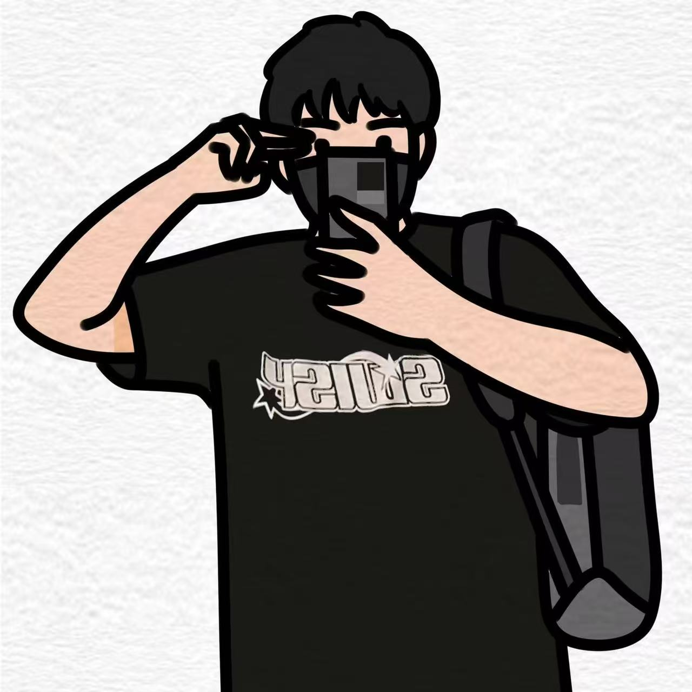

## Hi there 👋

<h3 align="center">A passionate MRse Pattern Recognition and Intelligent Systems student from XJTLU, Suzhou</h3>

  <!-- profile logo 个人资料徽标 -->
  

	&emsp;
    &emsp;
    &emsp;
    &emsp;
    &emsp;
    &emsp;
    </a>&emsp;
    <!-- visitor statistics logo 访问量统计徽标 -->
    
  

	
---

<table>
<table border="0">
  <tr>
    <td valign="top">
      

        <h3>Hello World! I am <b>Chen Mo.</b></h3>
        - 😄 Passionate about open source software. 
        - 👯 Enjoys cooperating with others. 
        - :sun_with_face: Respect for every scientific researcher. 
		- 🌱 Focus on life and improve myself. 
		- :1st_place_medal: My projects are trusted by developers.
      

    </td>
    <td valign="top" align="right">
      
      
      
    </td>
  </tr>
</table>

<!-- Snake Code Contribution Map 贪吃蛇代码贡献图 -->
<picture>
  <source media="(prefers-color-scheme: dark)" srcset="https://cdn.jsdelivr.net/gh/sun0225SUN/sun0225SUN/profile-snake-contrib/github-contribution-grid-snake-dark.svg" />
  <source media="(prefers-color-scheme: light)" srcset="https://cdn.jsdelivr.net/gh/sun0225SUN/sun0225SUN/profile-snake-contrib/github-contribution-grid-snake.svg" />
  
</picture>

---
<!-- 个人学历 -->

  <h3>EDUCATION</h3>
  
📚 9/2021 – 6/2025, B.Eng Electronic Information Engineering, Yangtze University

  
📚 9/2025 - Present, MRse Pattern Recognition and Intelligent Systems, Xi'an Jiaotong-Liverpool University

---
<!-- 荣誉奖项 -->

  <h3>HONORS & AWARDS</h3>
  
🏅 2024 Yangtze University First-Class Scholarship

  
🏅 2024 China College Student Computer Design Competition (Internet of Things Special Competition) – National Second Prize

  
🏅 2024 Challenge Cup College Student Extracurricular Academic and Technological Works Competition (揭榜挂帅) – National Third Prize

  
🏅 2023 Challenge Cup College Student Extracurricular Academic and Technological Works Competition (揭榜挂帅) – National Third Prize

---
<!-- 出版物 -->

  <h3>PUBLICATIONS</h3>
  
📝 Working hard on it. Coming soon!

---
- 🔭 I’m currently working on ...
- 🌱 I’m currently learning ...
- 👯 I’m looking to collaborate on ...
- 🤔 I’m looking for help with ...
- 💬 Ask me about ...
- 📫 How to reach me: ...
- 😄 Pronouns: ...
- ⚡ Fun fact: ...
---
